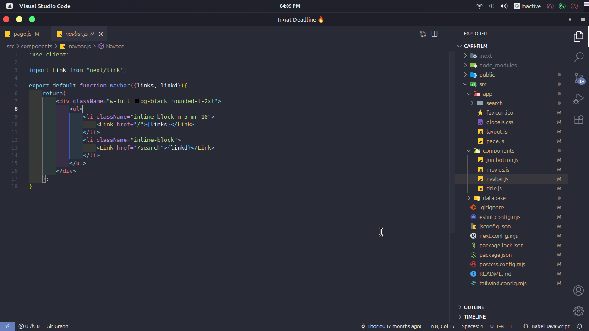

# Thor Simple Dark Colorful Code

🎨 A minimal dark theme with colorful syntax highlighting for better focus while coding.

## Features
- Colorful syntax (strings, variables, functions)
- Clean dark Background
- Optimized for web dev & backend dev

## Installation
1. Search `Thor Simple Dark Colorful Code` in VS Code Marketplace.
2. Click **Install**.
3. Activate via `Ctrl+K Ctrl+T` and choose the theme.

## Preview

## Author
**Thoriq**
