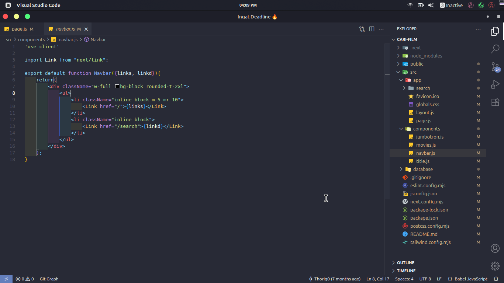

# Thor Simple Dark Colorful Code

Thor Simple Dark Colorful Code is a VS Code theme built for developers who want a calm dark workspace with colorful, readable syntax. The theme keeps the interface minimal while giving important tokens enough contrast to stay easy to scan during long coding sessions.

## Preview



## Highlights

- Dark, low-distraction editor background
- Colorful syntax for strings, functions, keywords, variables, and markup
- Consistent accents across tabs, sidebar, status bar, notifications, and lists
- Extra coverage for Markdown, JSON, Git changes, and terminal ANSI colors
- Semantic highlighting support for better results in modern language servers

## Installation

### From the VS Code Marketplace

1. Open Extensions in VS Code.
2. Search for `Thor Simple Dark Colorful Code`.
3. Click **Install**.
4. Open the command palette and run `Preferences: Color Theme`.
5. Select **Thor Simple Dark Colorful Code**.

### Manual installation

1. Clone this repository.
2. Run `npx @vscode/vsce package`.
3. In VS Code, open Extensions and choose `Install from VSIX...`.
4. Select the generated `.vsix` file.

## What is included

The theme currently styles:

- Editor, sidebar, tabs, panels, menus, notifications, lists, and status bar
- Syntax tokens for common programming languages and markup
- Markdown and JSON token scopes
- Git diff colors and terminal ANSI colors
- Semantic token colors for classes, functions, methods, parameters, properties, and variables

## Local development

If you want to preview changes locally:

1. Clone the repository.
2. Open it in VS Code.
3. Press `F5` to launch an Extension Development Host.
4. In the new window, switch to **Thor Simple Dark Colorful Code** from the theme picker.

The theme definition lives in [themes/thor-color-theme.json](./themes/thor-color-theme.json) and the extension metadata lives in [package.json](./package.json).

## Project structure

```text
.
|-- images/
|-- themes/
|   `-- thor-color-theme.json
|-- package.json
|-- README.md
`-- CHANGELOG.md
```

## Contributing

Issues and pull requests are welcome. If you want to improve the palette, scope coverage, or Marketplace presentation, feel free to open a discussion or submit a patch.

Repository: [github.com/Thoriq0/thor-simple-dark-colorful-code](https://github.com/Thoriq0/thor-simple-dark-colorful-code)

## License

This project is licensed under the [MIT License](./LICENSE).
